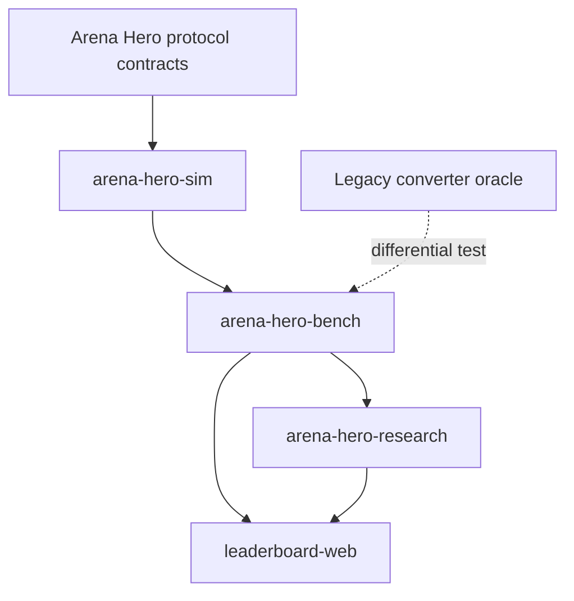

# Architecture

## Product scope

Arena Hero Lab combines four public product surfaces:

1. a deterministic simulation foundation;
2. reproducible benchmark and replay tooling;
3. research workflows over immutable artifacts;
4. a static leaderboard and replay explorer.

The monorepo intentionally does not share decision logic with an Arena Hero agent. Agents
and simulators should be evaluated through versioned contracts and fixtures rather than by
importing one another's implementation.

## Component model



### `arena-hero-sim`

Owns deterministic domain primitives, canonical serialization, world-state evolution,
visibility, replay projection, and explicit backend registration. The readable
`reference-engine` and stdlib-only `optimized-python-v1` backend share one workload runner and
fail-closed differential corpus; optimized caches remain internal and do not change immutable
public results. The package is dependency-light and excludes benchmark, research, web, agent,
SciPy, and Pandas dependencies. Platform contracts and performance evolution are documented in
[Simulator platform](simulator-platform.md).

### `arena-hero-bench`

Owns benchmark execution contracts, in-process and bounded local-process execution, a
filesystem content-addressed artifact store, shard/merge policy, contestant adapters, and
generated report conversion. A publishable run may reference only complete, verified artifacts.

### `arena-hero-research`

Owns preregistration, durable lifecycle chronology, paired confirmatory analysis, replication
evidence, public environment/SBOM provenance, and reproducible result bundles. Future
evolutionary and offline-learning methods remain in this package, never in the simulation hot
path. Analysis invariants and the scientific roadmap are
documented in [Research platform](research-platform.md).

### `leaderboard-web`

Owns browser presentation and static export. It renders generated reports but does not
recalculate authoritative rankings, significance, or publication eligibility.

## Dependency rules

```text
protocol contracts -> sim -> bench -> research
                              |
                              +-> generated web data -> web
```

Dependencies never point back toward simulation. Cross-package exchange uses immutable,
versioned artifacts instead of mutable shared state.

## Content-addressed artifacts

The foundation manifest fields are:

- `schema_version`
- `generator_version`
- `provenance`
- `source_build_sha256`
- `content_sha256`
- `status`
- `publishable`

`source_build_sha256` identifies the bytes used to construct a source build. It is not a Git
commit identifier. `content_sha256` identifies canonical artifact content. `partial` and
`failed` manifests must set `publishable=false`.

## Offline differential evidence

`arena-hero-bench` compares replay sides through two content-addressed,
CLI-only surfaces that never change public ranking semantics:

- `differential` (P6-2) classifies a TS-legacy replay against a Python-agent
  replay per tick and per run (`arena.bench.replay-differential.v1`).
- `kpi-differential` (P6-3) classifies an evolve-baseline replay against a
  Python-agent run across six independently computed behavior dimensions:
  `tick_alignment`, `resource_growth`, `collection_delivery`,
  `population_forces`, `survival_terminal`, and `decision_distribution`
  (`arena.bench.kpi-differential.v1`).

Every comparison is classified into exactly one of `MATCH`, `MISMATCH`,
`EXPECTED_UNKNOWN`, or `INCONCLUSIVE`; nothing is left unclassified. Both
reports are deterministic and content-addressed (identical inputs produce the
same artifact digest, input reordering does not change it). The Python side is
always consumed through the versioned offline importer, so torn tails, corrupt
records, duplicate ticks, and tenant mismatches fail closed.

Wire-contract gaps are declared, not inferred: `agent-run-v1` does not carry
world state and `differential-record-v1` does not carry decisions, so those
dimensions default to `EXPECTED_UNKNOWN`. A run manifest may bind sanitized
companion fixtures (an evolve decision trace and Python observation
snapshots) whose provenance is surfaced as `evidence_kind` in the report; the
committed corpus declares `sanitized_fixture`. Companion fixtures must cover
exactly the side's tick set and are validated fail-closed.

## Bounded offline replay soak

`arena-hero-bench` also ships a bounded offline replay soak driver
(`soak --run <manifest>`, `arena.bench.replay-soak.v1`) that repeatedly
replays the P6-2/P6-3 differential corpus and the canonical reference
workload through the bounded process executor for a configurable number of
rounds. Every round monitors open handles/fds, per-step content digests,
uncaught exceptions, and descendant-process residue; any anomaly fails the
soak with a classification (`step_exception`, `digest_drift`,
`resource_leak`, `process_residue`, `duration_exceeded`). The committed
manifest is a seconds-scale reproducible skeleton; the same manifest with a
larger `rounds`/`max_duration_seconds` extends to a 24h offline soak.
Reports are machine-readable and carry per-round step digests, leak and
exception counts, and a content hash of the emitted report.

## Release artifacts

`arena-hero-research` owns a deterministic release-bundle surface for the three
Python packages (`arena-hero-sim`, `arena-hero-bench`, `arena-hero-research`).
`scripts/release_artifacts.py` builds all packages twice from the same source
state, byte-compares both builds, and writes a bundle to `dist/release/`:

- the six built wheels and sdists, each bound to a SHA-256 digest;
- one minimal SBOM per package (`arena.research.sbom.v1`) listing declared
  workspace dependencies plus the Python runtime, with an explicit
  `declared-dependencies-and-python-runtime` scope;
- a content-addressed release manifest (`arena.lab.release-manifest.v1`)
  recording per-artifact digests, SBOM identities, source anchors (git commit,
  dirty flag, source-tree digest), a public environment snapshot, and the
  reproducibility evidence from the two builds.

The manifest and SBOMs are canonical JSON without timestamps, so the same
source state produces byte-identical release documents. The command is
offline-only and never publishes or deploys. When the two builds differ, the
manifest records every byte difference explicitly and the command exits
non-zero.

## Report conversion migration

The Python converter in `arena-hero-bench` is authoritative. The previous TypeScript
converter remains temporarily as an independent oracle. A fixed benchmark fixture is
converted by both implementations and parsed canonical JSON must be equal. The release
pipeline invokes Python directly and never falls back silently.

## Platform status evidence

`scripts/generate_platform.py` produces
`apps/leaderboard-web/src/data/platform.json` with schema `arena.platform.status.v2`.
The generator verifies frozen external Agent provenance, re-executes the canonical
reference-vs-optimized simulator differential, and recomputes the fit -> certificate ->
report research evidence chain through a scratch ledger.

The generator remains deterministic and fail-closed, and CI checks artifact freshness.
The public Leaderboard does not render this evidence document: its user-facing surface is
rankings, scenarios, score profiles, heatmaps, methodology, and replay entry pages only.


## Web hosting compatibility

The web app defaults to `/arena-hero-lab`, matching the public repository and Pages
site. Hosting changes, default-branch changes, and publication remain explicit release
operations rather than side effects of source-layout work.
