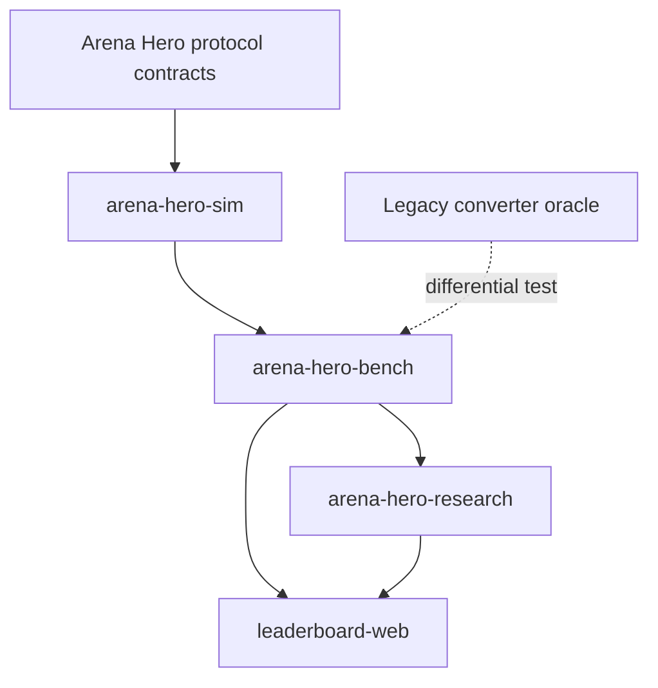

# Architecture

## Product scope

Arena Hero Lab combines four public product surfaces:

1. a deterministic simulation foundation;
2. reproducible benchmark and replay tooling;
3. research workflows over immutable artifacts;
4. a static leaderboard and replay explorer.

The monorepo intentionally does not share decision logic with an Arena Hero agent. Agents
and simulators should be evaluated through versioned contracts and fixtures rather than by
importing one another's implementation.

## Component model



### `arena-hero-sim`

Owns deterministic domain primitives, canonical serialization, world-state evolution,
visibility, and replay projection. The package is dependency-light and excludes benchmark,
research, web, agent, SciPy, and Pandas dependencies. Platform contracts and performance
evolution are documented in [Simulator platform](simulator-platform.md).

### `arena-hero-bench`

Owns benchmark execution contracts, in-process and bounded local-process execution, a
filesystem content-addressed artifact store, shard/merge policy, contestant adapters, and
generated report conversion. A publishable run may reference only complete, verified artifacts.

### `arena-hero-research`

Owns preregistration, durable lifecycle chronology, paired confirmatory analysis, replication
evidence, public environment/SBOM provenance, and reproducible result bundles. Future
evolutionary and offline-learning methods remain in this package, never in the simulation hot
path. Analysis invariants and the scientific roadmap are
documented in [Research platform](research-platform.md).

### `leaderboard-web`

Owns browser presentation and static export. It renders generated reports but does not
recalculate authoritative rankings, significance, or publication eligibility.

## Dependency rules

```text
protocol contracts -> sim -> bench -> research
                              |
                              +-> generated web data -> web
```

Dependencies never point back toward simulation. Cross-package exchange uses immutable,
versioned artifacts instead of mutable shared state.

## Content-addressed artifacts

The foundation manifest fields are:

- `schema_version`
- `generator_version`
- `provenance`
- `source_build_sha256`
- `content_sha256`
- `status`
- `publishable`

`source_build_sha256` identifies the bytes used to construct a source build. It is not a Git
commit identifier. `content_sha256` identifies canonical artifact content. `partial` and
`failed` manifests must set `publishable=false`.

## Report conversion migration

The Python converter in `arena-hero-bench` is authoritative. The previous TypeScript
converter remains temporarily as an independent oracle. A fixed benchmark fixture is
converted by both implementations and parsed canonical JSON must be equal. The release
pipeline invokes Python directly and never falls back silently.

## Web hosting compatibility

The web app defaults to `/arena-hero-lab`, matching the public repository and Pages
site. Hosting changes, default-branch changes, and publication remain explicit release
operations rather than side effects of source-layout work.
