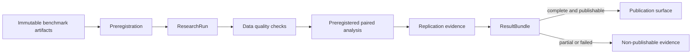

# Research platform

## Purpose

`arena-hero-research` turns immutable benchmark observations into preregistered,
content-addressed scientific results. It is an offline research surface: statistical work,
optional scientific libraries, and exploratory notebooks never enter the simulator hot path.

The initial implemented design is a confirmatory paired-comparison workflow. Broader study
designs, replication executors, simulated power, and distributed analysis remain explicit
extension points.

## Components



Benchmark orchestration, shard execution, and artifact storage are supplied by
`arena-hero-bench`. Research consumes their immutable outputs and adds study design,
analysis, replication policy, and scientific provenance.

## Research lifecycle

1. **Question** — define a stable question identifier, scientific statement, and estimand.
2. **Hypotheses** — bind each confirmatory outcome to one directional or two-sided claim,
   null value, and minimum scientifically relevant effect.
3. **Design** — declare randomized factors, assignment unit, blocking and pairing keys,
   outcome roles, missing-data policy, and replication structure.
4. **Analysis plan** — freeze estimator, effect size, confidence interval, alpha,
   multiplicity policy, power target, minimum detectable effect, and sample size.
5. **Preregistration** — create a canonical SHA-256 commitment before observations are
   analyzed. Every analysis verifies the commitment.
6. **Run** — bind the study to frozen configuration, source build, input data,
   environment, and SBOM digests.
7. **Quality and analysis** — enforce the declared missing-data policy and evaluate every
   confirmatory outcome in preregistered order.
8. **Replication** — retain independent seeds, required successful replication count,
   environment classes, and observation capacity as design evidence.
9. **Result bundle** — package estimates, quality reports, provenance, environment
   metadata, status, and publication eligibility under a reproducible content digest.

## Immutable contracts

The public contracts are frozen dataclasses:

- `ResearchQuestion`
- `Hypothesis`
- `Factor`
- `Outcome`
- `ReplicationPlan`
- `AnalysisPlan`
- `ExperimentDesign`
- `Preregistration`
- `ResearchRun`
- `ResultBundle`

Construction rejects duplicate identifiers, duplicate factor levels, duplicate pairing or
blocking keys, invalid digest formats, incomplete confirmatory hypothesis coverage, missing
primary outcomes, and replication plans that cannot supply the planned observation count.

## Preregistration and canonical identity

`Preregistration.create` produces schema `arena.research.preregistration.v1` and hashes a
canonical JSON-compatible payload. The payload includes question, hypotheses, factors,
outcomes, pairing, randomization and seed policy, replication capacity, analysis methods,
power assumptions, and an ISO-8601 registration timestamp with an explicit UTC offset.

A modified preregistration no longer verifies against its stored digest. Analysis and
`ResearchRun` construction reject such a mismatch.

## Randomization, pairing, and seeds

A paired design declares:

- which factors are randomized;
- the assignment unit;
- blocking keys used to reduce nuisance variation;
- pairing keys used to align control and treatment observations;
- a named seed policy;
- one seed per replication, with uniqueness required for independent replications;
- observations contributed by each successful replication.

The current package validates and records this policy but does not generate assignments or
execute replications. Those functions belong behind benchmark executor interfaces. Bootstrap
confidence intervals use an explicit seed; multiple outcomes derive deterministic seeds from
the base seed and preregistered outcome order.

## Effect size, intervals, and multiplicity

The implemented analysis surface is deliberately narrow and honest:

- estimator: paired treatment-minus-control mean difference;
- standardized effect: Cohen's dz when paired differences have non-zero variance;
- confidence interval: deterministic paired-bootstrap percentile interval;
- p-value: direction-aware paired normal approximation;
- minimum-effect result: explicit comparison against the preregistered scientific threshold;
- multiplicity: Benjamini-Hochberg false-discovery-rate adjustment.

Unsupported estimator, effect-size, or confidence-interval labels are rejected rather than
silently producing results under a false method name. A zero-variance paired difference
produces an undefined standardized effect and an explicit warning.

Multiple confirmatory outcomes require a declared multiplicity policy. The orchestrated
analysis requires every confirmatory outcome and rejects undeclared outcomes. It never
searches for or publishes only the most favorable result.

## Hierarchical clustered outcomes

A second, independent surface fits a two-level random-intercept model for clustered or
repeated-measure outcomes:

```text
Y_ij = mu + beta * T_ij + u_i + e_ij
```

with independent random intercepts ``u_i ~ N(0, sigma2_u)`` per cluster and errors
``e_ij ~ N(0, sigma2_e)``. The data grain is
(outcome, cluster, observation, treatment, value) via the frozen ``ClusterObservation``
record. Every fit registers explicit ``control_level`` and ``treatment_level`` labels;
the estimand is the directed **within-cluster (conditional) average treatment contrast**
``beta = E[Y | T=treatment, u] - E[Y | T=control, u]``, constant over every cluster and
independent of lexical label ordering.

- estimator: profile REML over ``lambda = sigma2_u / sigma2_e`` with a closed-form
  fixed-``lambda`` GLS (stdlib only, no NumPy/SciPy/Pandas/Statsmodels);
- independent cross-validation path: within-cluster OLS + between-cluster method-of-moments
  (MoM/ANOVA), compared against the REML result with declared tolerances;
- allocation-balanced fixtures use the strict ``1e-8`` effect tolerance. Variance
  conformance at ``1e-7`` is currently preregistered only for the paired allocation
  (one control and one treatment observation per cluster);
- balanced repeated-observation and allocation-unbalanced fixtures expose separate
  ``effect_passed``, ``variance_validated``, and ``variance_passed`` fields. Their MoM
  variance is not yet a calibrated finite-sample conformance oracle, so
  ``variance_validated=false`` and aggregate ``passed=false`` even when the effect check
  passes;
- confidence interval: conservative between-cluster t with ``df = cluster_count - 1``;
  this is **not** Satterthwaite or Kenward-Roger;
- effect size: ``hierarchical-d-v1 = beta / sqrt(sigma2_u + sigma2_e)``; this is **not**
  Cohen's d or Cohen's dz;
- canonical identity: schema ``arena.research.random-intercept-fit.v2`` includes the
  explicit control/treatment direction and a content-addressed SHA-256 over the frozen
  payload; ``RandomInterceptFit.from_dict`` requires the exact v2 key set and original
  JSON types, rejects normalization/unknown fields, and verifies the digest. Observations
  are canonicalized by ``(cluster_id, treatment level, observation_id)`` before sufficient
  statistics are formed; duplicate observation identities within a cluster are rejected, so
  input permutation cannot change a fit identity.

### Solver certificate and cross-validation evidence

The compatibility entrypoints remain frozen: `fit_random_intercept` still emits
`arena.research.random-intercept-fit.v2`, and `cross_validate_random_intercept` still
returns the original unversioned projection. The evidence workflow is additive:

- `fit_random_intercept_with_certificate` emits the unchanged Fit v2 plus
  `arena.research.profile-reml-solver-certificate.v1`;
- `analyze_hierarchical_evidence` returns the acyclic chain Fit v2 → SolverCertificate v1
  → `arena.research.cross-validation-report.v1`;
- the certificate binds both the canonical source input and the retained numerical analysis
  input after the declared missing-data policy, plus the Fit v2 schema and digest;
- the traced bounded golden-section optimizer records every valid or explicitly invalid
  objective evaluation, initial/final brackets, iteration/evaluation counts, termination,
  candidate, analytic profile score/curvature, KKT residual/tolerance, backward error, and
  Newton correction; finite differences are test-only oracles and never authoritative data;
- report profiles are `paired-1x1`, `balanced-repeated`, and
  `allocation-unbalanced`. Only paired `effect-and-variance` evidence may be
  `fully-validated` with `passed=true`; balanced repeated and unbalanced designs are
  `effect-only` diagnostics and never validate variance; boundary or indeterminate solver
  evidence has scope `none` and `passed=false`;
- `commit_hierarchical_analysis_evidence` writes fit, certificate, and report as three
  immutable objects referenced by one hash-chained ledger transaction. Restore requires the
  exact three-record set in the same transaction, strict loaders, content verification, and
  forward-reference verification.

The solver certificate proves only reproducible local numerical conditions for this declared
algorithm and bounded search interval. It does **not** prove global unimodality or a global
optimum. It is not a digital signature, independent implementation, third-party attestation,
or production suitability claim.

The checked-in literal corpus is a strict, content-addressed reference artifact for its
recorded runtime. Fit v2 remains byte-stable across the supported CI matrix. Solver traces
contain binary64/libm-sensitive intermediate evaluations, so cross-platform recomputation
verifies exact identities and statuses plus explicit numerical tolerances; redundant
`lambda = exp(log_lambda)` fields permit at most four ULP of loader roundoff. The platform
does not claim that certificate or report digests are identical across operating systems or
math libraries.

Fail-closed gates (no silent fallback):

- fewer than two complete clusters, non-finite or numerically overflowing values, or
  clusters missing a declared control/treatment level are rejected with typed research errors;
- cluster-randomized designs (no within-cluster treatment variation anywhere) are
  rejected as unidentifiable for the within-cluster estimand;
- a missing-level policy is declared up front with the strict ``ClusterMissingPolicy``
  enum: ``FAIL`` rejects the incomplete cluster, while ``DROP_CLUSTER`` drops it and records
  the count and a warning; string coercion is rejected;
- a singular or boundary between-cluster variance produces no confidence interval, no
  standard error, and no effect-size claim, and is reported explicitly;
- the paired design (one control and one treatment per cluster) is the balanced degenerate
  case: ``paired_to_cluster_observations`` bridges pairs and the REML treatment effect
  reproduces the existing paired mean difference.

Non-claims: this surface is a minimal real random-intercept model, not an lme4/nlme
replacement. It does not implement random slopes, nested/multilevel structures, GLMMs,
Kenward-Roger or Satterthwaite degrees of freedom, cluster-robust sandwich errors, or
inference for cluster-randomized (whole-cluster assignment) designs. Cluster-level power
for hierarchical designs is deliberately deferred to a later slice rather than shipped
half-baked.

## Power and sample size

`normal_approx_paired_sample_size` provides a dependency-light planning approximation from
standardized effect size, alpha, power, and test sidedness. `AnalysisPlan` records the chosen
planning method, target power, minimum detectable effect, and planned sample size.

This approximation is not a substitute for design-specific simulated power. The M5 surface
adds power simulation using the selected simulator backend and empirical variance models.
At analysis time, complete paired observations must meet the preregistered sample size.

## Data quality and missing observations

Confirmatory outcomes and the analysis plan must share one missing-data policy:

- `fail` rejects the study outcome on the first incomplete pair;
- `drop-pair` removes only incomplete pairs, records counts, and emits a warning.

Non-finite values are rejected. Each `DataQualityReport` records total, complete, missing,
and dropped pair counts. A result bundle verifies that its estimate sample size agrees with
the quality report.

## Provenance, environment, and SBOM

`ResearchRun` binds a study to five SHA-256 identities:

- frozen layered configuration;
- source build;
- input observations;
- execution environment;
- software bill of materials.

`ResultBundle` adds preregistration and analysis-plan digests plus public provenance and
environment metadata. Metadata is recursively immutable, JSON-compatible, and rejects
credential-like key names at any nesting depth. The reference implementation can capture a
bounded public environment snapshot and build a minimal explicit SBOM without reading ambient
environment variables, hostnames, usernames, or executable paths. CycloneDX/SPDX export,
vulnerability scanning, signatures, trusted timestamps, and external attestation remain seams.

## Publication and reproducibility

A reproducible bundle contains the preregistration commitment, method commitment, source
and data identities, deterministic estimates, data-quality evidence, environment evidence,
and run status. Identical inputs produce an identical `bundle_sha256`.

`partial` and `failed` runs are always non-publishable. A complete run may still be held back
by setting `publishable=false`, but no incomplete run may be promoted by metadata alone.

## Performance and hot-path boundary

Research is an offline path. Its budgets prioritize deterministic output, bounded memory,
and auditable methods rather than simulation tick latency.

| Surface | Initial budget |
| --- | --- |
| Determinism | Same input, plan, and seed produce identical estimates and bundle digest |
| Bootstrap cost | `O(B * n)` per outcome, where `B` is preregistered and at least 100 |
| Memory | Hold paired observations and one bootstrap sample, without dataframe expansion |
| Parallel evolution | Replication-level parallelism must preserve deterministic merge order |
| Publication | Digest mismatch, incomplete outcomes, partial, or failed status blocks publication |

No NumPy, SciPy, or Pandas dependency is required for the initial implementation. Future
optimized analysis backends must preserve the same contracts and canonical results within a
specified numerical tolerance.

## Extension points

- benchmark local/process executors and future distributed execution for replications;
- benchmark artifact stores for observation/result persistence;
- alternative environment/SBOM exporters and external attestations;
- sensitivity, survival, and sequential designs;
- hierarchical depth beyond random intercepts: random slopes, nested/multilevel models,
  GLMMs, and Kenward-Roger/Satterthwaite degrees of freedom;
- cluster-level power for hierarchical designs (deferred to a later slice);
- independent numerical implementations with declared tolerances (random-intercept REML
  and MoM/ANOVA cross-validation are implemented; further backends must preserve the same
  contracts within a specified tolerance);
- reproducible figure generation, signed publication, and reproduction services.

## Implementation status

| Capability | Status |
| --- | --- |
| Frozen research contracts and invariants | Implemented |
| Canonical preregistration hash and verification | Implemented |
| Paired effect, Cohen's dz, deterministic bootstrap CI | Implemented |
| BH-FDR and normal-approximation sample-size planning | Implemented |
| Missing-data enforcement and quality reports | Implemented |
| Content-addressed run and result bundle | Implemented |
| Assignment generation, replication execution, and strict merge | Implemented |
| Monte Carlo power and replication-aware conclusions | Implemented reference methods |
| Durable lifecycle chronology and immutable evidence ledger | Implemented filesystem reference |
| Public environment snapshot and minimal explicit SBOM | Implemented reference generators |
| Random-intercept REML + SolverCertificate v1 + versioned cross-validation evidence | Implemented (stdlib-only, fail-closed) |
| Cluster-level power for hierarchical designs | Deferred to a later slice |
| Distributed verification, signed attestation, publication service | Planned extension |

## M3-M7 evolution

- **M3 — Preregistered paired platform:** immutable contracts, canonical commitments,
  paired analysis, multiplicity, quality reports, and reproducible bundles.
- **M4 — Reproduction evidence:** assignment, strict replication merge, Monte Carlo power,
  public environment/SBOM provenance, and a durable filesystem ledger with enforced pilot →
  exploratory → confirmatory → replication → complete chronology are implemented.
- **M5 — Scientific depth:** sensitivity analysis remains planned; the random-intercept
  hierarchical slice (REML + independent MoM/ANOVA cross-validation) is implemented;
  deeper hierarchical designs and further numerical-backend conformance remain planned.
- **M6 — Parallel research:** benchmark process execution is available; richer research-level
  scheduling, resumable analysis artifacts, and resource isolation remain planned.
- **M7 — Distributed verification:** distributed executor integration, remote artifact store,
  signed provenance, independent reproduction, and publication attestations.
