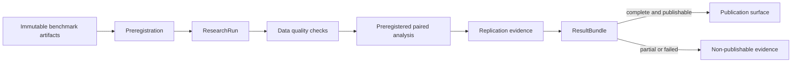

# Research platform

## Purpose

`arena-hero-research` turns immutable benchmark observations into preregistered,
content-addressed scientific results. It is an offline research surface: statistical work,
optional scientific libraries, and exploratory notebooks never enter the simulator hot path.

The initial implemented design is a confirmatory paired-comparison workflow. Broader study
designs, replication executors, simulated power, and distributed analysis remain explicit
extension points.

## Components

Benchmark orchestration, shard execution, and artifact storage are supplied by
`arena-hero-bench`. Research consumes their immutable outputs and adds study design,
analysis, replication policy, and scientific provenance.

## Research lifecycle

1. **Question** — define a stable question identifier, scientific statement, and estimand.
2. **Hypotheses** — bind each confirmatory outcome to one directional or two-sided claim,
   null value, and minimum scientifically relevant effect.
3. **Design** — declare randomized factors, assignment unit, blocking and pairing keys,
   outcome roles, missing-data policy, and replication structure.
4. **Analysis plan** — freeze estimator, effect size, confidence interval, alpha,
   multiplicity policy, power target, minimum detectable effect, and sample size.
5. **Preregistration** — create a canonical SHA-256 commitment before observations are
   analyzed. Every analysis verifies the commitment.
6. **Run** — bind the study to frozen configuration, source build, input data,
   environment, and SBOM digests.
7. **Quality and analysis** — enforce the declared missing-data policy and evaluate every
   confirmatory outcome in preregistered order.
8. **Replication** — retain independent seeds, required successful replication count,
   environment classes, and observation capacity as design evidence.
9. **Result bundle** — package estimates, quality reports, provenance, environment
   metadata, status, and publication eligibility under a reproducible content digest.

## Immutable contracts

The public contracts are frozen dataclasses:

- `ResearchQuestion`
- `Hypothesis`
- `Factor`
- `Outcome`
- `ReplicationPlan`
- `AnalysisPlan`
- `ExperimentDesign`
- `Preregistration`
- `ResearchRun`
- `ResultBundle`

Construction rejects duplicate identifiers, duplicate factor levels, duplicate pairing or
blocking keys, invalid digest formats, incomplete confirmatory hypothesis coverage, missing
primary outcomes, and replication plans that cannot supply the planned observation count.

## Preregistration and canonical identity

`Preregistration.create` produces schema `arena.research.preregistration.v1` and hashes a
canonical JSON-compatible payload. The payload includes question, hypotheses, factors,
outcomes, pairing, randomization and seed policy, replication capacity, analysis methods,
power assumptions, and an ISO-8601 registration timestamp with an explicit UTC offset.

A modified preregistration no longer verifies against its stored digest. Analysis and
`ResearchRun` construction reject such a mismatch.

## Randomization, pairing, and seeds

A paired design declares:

- which factors are randomized;
- the assignment unit;
- blocking keys used to reduce nuisance variation;
- pairing keys used to align control and treatment observations;
- a named seed policy;
- one seed per replication, with uniqueness required for independent replications;
- observations contributed by each successful replication.

The current package validates and records this policy but does not generate assignments or
execute replications. Those functions belong behind benchmark executor interfaces. Bootstrap
confidence intervals use an explicit seed; multiple outcomes derive deterministic seeds from
the base seed and preregistered outcome order.

## Effect size, intervals, and multiplicity

The implemented analysis surface is deliberately narrow and honest:

- estimator: paired treatment-minus-control mean difference;
- standardized effect: Cohen's dz when paired differences have non-zero variance;
- confidence interval: deterministic paired-bootstrap percentile interval;
- p-value: direction-aware paired normal approximation;
- minimum-effect result: explicit comparison against the preregistered scientific threshold;
- multiplicity: Benjamini-Hochberg false-discovery-rate adjustment.

Unsupported estimator, effect-size, or confidence-interval labels are rejected rather than
silently producing results under a false method name. A zero-variance paired difference
produces an undefined standardized effect and an explicit warning.

Multiple confirmatory outcomes require a declared multiplicity policy. The orchestrated
analysis requires every confirmatory outcome and rejects undeclared outcomes. It never
searches for or publishes only the most favorable result.

## Power and sample size

`normal_approx_paired_sample_size` provides a dependency-light planning approximation from
standardized effect size, alpha, power, and test sidedness. `AnalysisPlan` records the chosen
planning method, target power, minimum detectable effect, and planned sample size.

This approximation is not a substitute for design-specific simulated power. The M5 surface
adds power simulation using the selected simulator backend and empirical variance models.
At analysis time, complete paired observations must meet the preregistered sample size.

## Data quality and missing observations

Confirmatory outcomes and the analysis plan must share one missing-data policy:

- `fail` rejects the study outcome on the first incomplete pair;
- `drop-pair` removes only incomplete pairs, records counts, and emits a warning.

Non-finite values are rejected. Each `DataQualityReport` records total, complete, missing,
and dropped pair counts. A result bundle verifies that its estimate sample size agrees with
the quality report.

## Provenance, environment, and SBOM

`ResearchRun` binds a study to five SHA-256 identities:

- frozen layered configuration;
- source build;
- input observations;
- execution environment;
- software bill of materials.

`ResultBundle` adds preregistration and analysis-plan digests plus public provenance and
environment metadata. Metadata is recursively immutable, JSON-compatible, and rejects
credential-like key names at any nesting depth. The reference implementation can capture a
bounded public environment snapshot and build a minimal explicit SBOM without reading ambient
environment variables, hostnames, usernames, or executable paths. CycloneDX/SPDX export,
vulnerability scanning, signatures, trusted timestamps, and external attestation remain seams.

## Publication and reproducibility

A reproducible bundle contains the preregistration commitment, method commitment, source
and data identities, deterministic estimates, data-quality evidence, environment evidence,
and run status. Identical inputs produce an identical `bundle_sha256`.

`partial` and `failed` runs are always non-publishable. A complete run may still be held back
by setting `publishable=false`, but no incomplete run may be promoted by metadata alone.

## Performance and hot-path boundary

Research is an offline path. Its budgets prioritize deterministic output, bounded memory,
and auditable methods rather than simulation tick latency.

| Surface | Initial budget |
| --- | --- |
| Determinism | Same input, plan, and seed produce identical estimates and bundle digest |
| Bootstrap cost | `O(B * n)` per outcome, where `B` is preregistered and at least 100 |
| Memory | Hold paired observations and one bootstrap sample, without dataframe expansion |
| Parallel evolution | Replication-level parallelism must preserve deterministic merge order |
| Publication | Digest mismatch, incomplete outcomes, partial, or failed status blocks publication |

No NumPy, SciPy, or Pandas dependency is required for the initial implementation. Future
optimized analysis backends must preserve the same contracts and canonical results within a
specified numerical tolerance.

## Extension points

- benchmark local/process executors and future distributed execution for replications;
- benchmark artifact stores for observation/result persistence;
- alternative environment/SBOM exporters and external attestations;
- sensitivity, hierarchical, mixed-effects, survival, and sequential designs;
- independent numerical implementations with declared tolerances;
- reproducible figure generation, signed publication, and reproduction services.

## Implementation status

| Capability | Status |
| --- | --- |
| Frozen research contracts and invariants | Implemented |
| Canonical preregistration hash and verification | Implemented |
| Paired effect, Cohen's dz, deterministic bootstrap CI | Implemented |
| BH-FDR and normal-approximation sample-size planning | Implemented |
| Missing-data enforcement and quality reports | Implemented |
| Content-addressed run and result bundle | Implemented |
| Assignment generation, replication execution, and strict merge | Implemented |
| Monte Carlo power and replication-aware conclusions | Implemented reference methods |
| Durable lifecycle chronology and immutable evidence ledger | Implemented filesystem reference |
| Public environment snapshot and minimal explicit SBOM | Implemented reference generators |
| Hierarchical/mixed-effects and independent numerical backends | Planned extension |
| Distributed verification, signed attestation, publication service | Planned extension |

## M3-M7 evolution

- **M3 — Preregistered paired platform:** immutable contracts, canonical commitments,
  paired analysis, multiplicity, quality reports, and reproducible bundles.
- **M4 — Reproduction evidence:** assignment, strict replication merge, Monte Carlo power,
  public environment/SBOM provenance, and a durable filesystem ledger with enforced pilot →
  exploratory → confirmatory → replication → complete chronology are implemented.
- **M5 — Scientific depth:** sensitivity analysis, hierarchical designs, and independent
  numerical-backend conformance remain planned.
- **M6 — Parallel research:** benchmark process execution is available; richer research-level
  scheduling, resumable analysis artifacts, and resource isolation remain planned.
- **M7 — Distributed verification:** distributed executor integration, remote artifact store,
  signed provenance, independent reproduction, and publication attestations.
