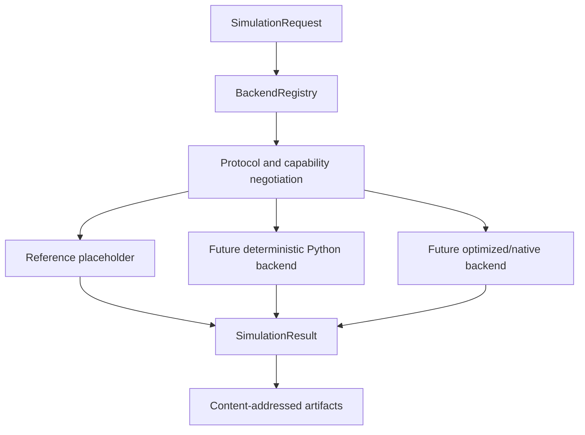
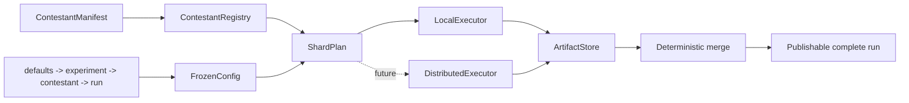

# Simulator platform

## Purpose

`arena-hero-sim` is the backend-neutral simulator platform. It defines immutable requests,
results, rules identities, capability negotiation, backend registration, batch execution, and
performance evidence without coupling the platform to one engine implementation.

The built-in `reference-placeholder` backend validates integration contracts only. It always
returns `unsupported` and is not a game-rules engine.

## Components



### Immutable contracts

- `RulesetRef` binds a portable rules name and version to a SHA-256 digest.
- `SimulatorConfig` freezes backend id, engine version, deterministic seed, tick budget,
  protocol version, requested features, and parameters.
- `SimulationRequest` binds a request/episode identity to contestants and input digests.
- `SimulationResult` records engine identity, rules digest, seed, status, world digest,
  metrics, artifacts, and publication eligibility.
- `BackendCapabilities` advertises batch size, execution modes, protocol versions,
  incremental hashing, zero-copy support, and interchange formats.

All incomplete, failed, and unsupported results are non-publishable.

## Hot path design

The contracts deliberately permit several replaceable hot-path implementations:

1. **Structure-of-arrays or ECS storage** for dense unit state and cache-friendly phase loops.
2. **Incremental world hashing** where a backend updates deterministic region/component
   digests instead of serializing the complete world every tick.
3. **Batch episode execution** through `simulate_batch`, with registry-controlled chunking.
4. **Process-local parallelism** with deterministic request ordering and isolated RNG streams.
5. **Optional zero-copy interchange** for stable buffers. Canonical JSON remains the baseline;
   Arrow-compatible buffers may be negotiated by capability rather than required globally.

NumPy, Pandas, Arrow, native extensions, and GPU runtimes are not core dependencies. A backend
may add them behind capabilities and must pass the same conformance suite.

## Capability negotiation

A request selects exactly one backend id and engine version. The registry rejects:

- unknown backends;
- duplicate backend registrations;
- unsupported protocol versions;
- requested features absent from the backend capability set;
- mixed-backend batches;
- results whose request, rules, seed, or engine identity differs from the request.

This prevents an optimized backend from silently dropping a rule or feature.

## Microbenchmark harness

Run the local contract-dispatch microbenchmark:

```bash
uv run arena-hero-sim-bench --episodes 10000 --repeats 5 --batch-size 256
```

Schema: `arena.sim.microbenchmark.v1`.

The harness measures immutable request validation, registry negotiation, batch chunking, and
placeholder result construction. It sets `production_claim=false`; it does not measure game
simulation throughput. Reports contain durations, median, p95, throughput, Python version,
platform family, backend id, and engine version without host identity.

The same command selects the real-engine harness against the frozen canonical workload:

```bash
uv run arena-hero-sim-bench --benchmark reference-workload --repeats 5 --batch-size 9
```

Schema: `arena.sim.reference-workload-benchmark.v1`. A round is exactly one execution of the
canonical 9-episode reference workload through the real engine, including the known-answer
gate and the semantic run digest. `--episodes` is rejected for this selector because a round
is a fixed semantic unit, not a copyable scenario count. The report binds the workload and
run digests, retains raw per-round durations with median/p95, and records backend identity
plus Python/platform metadata without host identity. It always sets `production_claim=false`.

## Reference workload gate

The backend-neutral workload contract and the mandatory reference/optimized differential gate are
defined in [`reference-workloads.md`](reference-workloads.md). A real performance claim must bind a
content-addressed workload manifest and retain raw measurement samples. Contract dispatch remains
a separate overhead signal and cannot be promoted into engine-throughput evidence.

## Performance budgets

Performance budgets are evidence gates, not marketing claims:

| Surface | Foundation budget |
|---|---|
| Contract-dispatch median | No more than 15% regression against a same-machine pinned baseline |
| Batch determinism | Identical result ordering and digests for batch sizes 1, 2, 4, and configured maximum |
| Allocation policy | Hot-path state may be reused internally but public requests/results remain immutable |
| World hashing | Full and incremental digests must match on conformance fixtures |
| Parallel execution | Worker count must not alter episode or merged run digests |
| Interchange | Canonical JSON is required; zero-copy/Arrow paths are optional negotiated accelerators |

A real engine baseline will add ticks/second, p50/p95/p99 tick latency, peak RSS, world size,
and artifact throughput using shared semantic fixtures.

## Extension points

- `SimulatorBackend` for Python, native, remote, or accelerator-backed engines.
- `BackendCapabilities` for feature and data-boundary negotiation.
- `BackendRegistry` for deterministic selection and validation.
- `simulate_batch` for vectorized or multi-episode backends.
- content-addressed inputs/results for replay, resume, and distributed execution.

## Benchmark platform control plane



### Contestant registry

A contestant is registered by a versioned manifest containing entry point, language,
runtime, protocol version, artifact SHA-256, configuration schema, resource requirements,
capabilities, and isolation policy. The registry rejects duplicate id/version pairs and
artifact digest mismatches. Core packages do not contain a fixed contestant or model catalog.

### Configuration snapshots

Configuration resolution is strict and ordered:

```text
schema defaults -> defaults layer -> experiment -> contestant -> run overrides
```

Every layer rejects unknown keys and type/range violations. Secret-designated fields are
runtime-only and rejected from frozen snapshots. The resolved snapshot and each source layer
receive canonical SHA-256 digests so a run can be reproduced without embedding credentials.

### Execution and merge

`ShardPlan` binds experiment, run, shard, operation, request identities, and a canonical plan
digest. `LocalBatchExecutor` executes in-process through the backend registry. The bounded
`ProcessExecutor` uses explicit backend specifications, spawn-safe versioned envelopes,
timeouts, process-tree cleanup, output limits, and deterministic result ordering; it never
silently falls back to in-process execution and is not a contestant security sandbox.

`FilesystemArtifactStore` is the local reference `ArtifactStore`: immutable bytes and manifest
records are content-addressed, atomically written, verified on read, and protected by a
fail-closed writer mutex. Identical operations resume through the execution ledger; reusing an
operation id with a different plan fails closed. `DistributedExecutor` remains a protocol for
future schedulers and remote stores. Merge requires exact shard coverage, one result per shard,
one run id, complete status, and publishable artifacts. Input order does not affect the digest.
## M3-M7 evolution

- **M3 — platform contracts:** immutable contracts, registry, placeholder, batch API, local
  microbenchmark, and conformance tests. Implemented in this slice.
- **M4 — deterministic reference engine:** immutable world, visibility, replay, harvest/deposit,
  and simultaneous unit movement chains/swaps/cycles are implemented against pinned oracle
  evidence. Combat, Beacon, Core movement, and official winner/score remain unsupported.
- **M5 — optimized backend:** SoA/ECS storage, real-engine profiling, bounded allocation, and
  differential regression budgets against M4 semantics remain planned.
- **M6 — local scale:** deterministic sharding/resume, the filesystem artifact store, and a
  bounded spawn-safe process executor are implemented as reference adapters. Arrow, resource
  isolation, and contestant sandboxing remain planned.
- **M7 — distributed scale:** remote executor adapters and stores, failure injection, and
  reproducible distributed release evidence remain planned.
